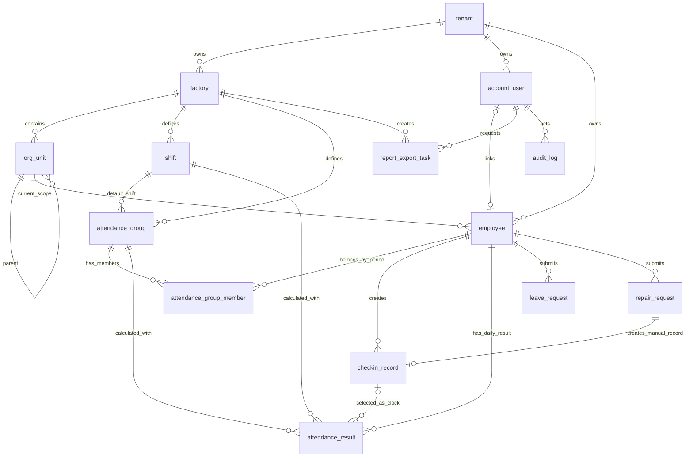

# Factory ERP Lite ER Model

版本：1.0  
来源：`factory-erp-attendance-design-v3.md`  
日期：2026-05  

---

## 1. 设计目标

本文档描述 Factory ERP Lite 考勤 MVP 的核心实体、关系、约束和索引建议。目标是为后续 Prisma Schema、迁移文件和接口 DTO 提供稳定的数据建模依据。

建模原则：

- `tenant_id` 是最高数据隔离边界，所有业务表必须携带。
- `factory_id` 是考勤地点、Wi-Fi、报表和数据权限的重要边界。
- 组织结构使用 `org_unit` 弹性树，不强制小微企业维护多级车间/班组。
- 员工档案与登录账号分离。
- 考勤组独立于组织结构，使用历史成员表维护考勤归属。
- 打卡原始记录不可变，补卡和人工修正通过新增记录与审计链路表达。

---

## 2. 核心关系图

---

## 3. 核心表

### 3.1 `tenant`

| 字段 | 类型 | 约束 |
| --- | --- | --- |
| `id` | UUID | PK |
| `name` | VARCHAR(128) | NOT NULL |
| `status` | ENUM('ACTIVE','DISABLED') | NOT NULL |
| `created_at` | TIMESTAMPTZ | NOT NULL |
| `updated_at` | TIMESTAMPTZ | NOT NULL |
| `deleted_at` | TIMESTAMPTZ | NULL |

### 3.2 `factory`

| 字段 | 类型 | 约束 |
| --- | --- | --- |
| `id` | UUID | PK |
| `tenant_id` | UUID | FK -> tenant, NOT NULL |
| `name` | VARCHAR(128) | NOT NULL |
| `address` | VARCHAR(256) | NULL |
| `timezone` | VARCHAR(64) | NOT NULL, 默认 `Asia/Shanghai` |
| `status` | ENUM('ACTIVE','DISABLED') | NOT NULL |
| `created_at / updated_at / deleted_at` | TIMESTAMPTZ | 标准时间戳 |

索引：

- `INDEX (tenant_id, status)`

### 3.3 `org_unit`

用于表达工厂下的弹性组织结构。小微企业可以不建组织单元，员工直接归属工厂。

| 字段 | 类型 | 约束 |
| --- | --- | --- |
| `id` | UUID | PK |
| `tenant_id` | UUID | NOT NULL |
| `factory_id` | UUID | FK -> factory, NOT NULL |
| `parent_id` | UUID | FK -> org_unit, NULL |
| `name` | VARCHAR(64) | NOT NULL |
| `type` | ENUM('DEPARTMENT','WORKSHOP','LINE','TEAM','GROUP','CUSTOM') | NOT NULL |
| `sort_order` | INTEGER | NOT NULL, 默认 0 |
| `status` | ENUM('ACTIVE','DISABLED') | NOT NULL |
| `created_at / updated_at / deleted_at` | TIMESTAMPTZ | 标准时间戳 |

索引：

- `INDEX (tenant_id, factory_id, parent_id)`
- `INDEX (tenant_id, factory_id, status)`

约束：

- `parent_id` 指向的组织单元必须属于同一 `tenant_id` 与 `factory_id`。
- 删除组织单元前必须确认不存在有效员工和子组织。

### 3.4 `account_user`

| 字段 | 类型 | 约束 |
| --- | --- | --- |
| `id` | UUID | PK |
| `tenant_id` | UUID | NOT NULL |
| `employee_id` | UUID | FK -> employee, NULL |
| `phone` | VARCHAR(20) | NOT NULL |
| `password_hash` | VARCHAR(255) | NOT NULL |
| `status` | ENUM('ACTIVE','DISABLED') | NOT NULL |
| `last_login_at` | TIMESTAMPTZ | NULL |
| `created_at / updated_at / deleted_at` | TIMESTAMPTZ | 标准时间戳 |

索引：

- `UNIQUE (tenant_id, phone)`
- `INDEX (tenant_id, employee_id)`

### 3.4.1 `account_role`

用于维护账号拥有的系统角色。角色枚举来自权限矩阵：`TENANT_ADMIN`、`HR_ADMIN`、`ORG_MANAGER`、`EMPLOYEE`。

| 字段 | 类型 | 约束 |
| --- | --- | --- |
| `id` | UUID | PK |
| `tenant_id` | UUID | NOT NULL |
| `account_user_id` | UUID | FK -> account_user, NOT NULL |
| `role_name` | ENUM | NOT NULL |
| `created_at` | TIMESTAMPTZ | NOT NULL |

索引：

- `UNIQUE (tenant_id, account_user_id, role_name)`
- `INDEX (tenant_id, role_name)`

### 3.4.2 `account_data_scope`

用于维护账号的数据访问范围。权限判断由角色权限与数据范围共同决定。

| 字段 | 类型 | 约束 |
| --- | --- | --- |
| `id` | UUID | PK |
| `tenant_id` | UUID | NOT NULL |
| `account_user_id` | UUID | FK -> account_user, NOT NULL |
| `scope_type` | ENUM('TENANT','FACTORY','ORG_UNIT','EMPLOYEE') | NOT NULL |
| `factory_id` | UUID | NULL，`FACTORY` 范围时使用 |
| `org_unit_id` | UUID | NULL，`ORG_UNIT` 范围时使用 |
| `employee_id` | UUID | NULL，`EMPLOYEE` 范围时使用 |
| `created_at` | TIMESTAMPTZ | NOT NULL |

索引：

- `INDEX (tenant_id, account_user_id, scope_type)`
- `INDEX (tenant_id, factory_id)`
- `INDEX (tenant_id, org_unit_id)`
- `INDEX (tenant_id, employee_id)`

### 3.4.3 `account_refresh_token`

用于持久化 refresh token 会话，支持刷新令牌轮换、退出登录撤销和多实例部署下的一致认证状态。

| 字段 | 类型 | 约束 |
| --- | --- | --- |
| `id` | UUID | PK，对应 refresh token `jti` |
| `tenant_id` | UUID | NOT NULL |
| `account_user_id` | UUID | FK -> account_user, NOT NULL |
| `expires_at` | TIMESTAMPTZ | NOT NULL |
| `revoked_at` | TIMESTAMPTZ | NULL |
| `created_at` | TIMESTAMPTZ | NOT NULL |

索引：

- `INDEX (tenant_id, account_user_id, revoked_at)`
- `INDEX (expires_at)`

### 3.5 `employee`

| 字段 | 类型 | 约束 |
| --- | --- | --- |
| `id` | UUID | PK |
| `tenant_id` | UUID | NOT NULL |
| `factory_id` | UUID | FK -> factory, NOT NULL |
| `org_unit_id` | UUID | FK -> org_unit, NULL |
| `emp_no` | VARCHAR(32) | NOT NULL |
| `name` | VARCHAR(64) | NOT NULL |
| `phone` | VARCHAR(20) | NULL |
| `id_card` | VARCHAR(32) | NULL，展示时脱敏 |
| `gender` | ENUM('MALE','FEMALE','OTHER') | NULL |
| `entry_date` | DATE | NOT NULL |
| `exit_date` | DATE | NULL |
| `status` | ENUM('ACTIVE','INACTIVE','RESIGNED') | NOT NULL |
| `device_id` | VARCHAR(128) | NULL |
| `created_at / updated_at / deleted_at` | TIMESTAMPTZ | 标准时间戳 |

索引：

- `UNIQUE (tenant_id, emp_no)`
- `INDEX (tenant_id, factory_id, status)`
- `INDEX (tenant_id, org_unit_id)`

### 3.6 `shift`

| 字段 | 类型 | 约束 |
| --- | --- | --- |
| `id` | UUID | PK |
| `tenant_id` | UUID | NOT NULL |
| `factory_id` | UUID | FK -> factory, NOT NULL |
| `name` | VARCHAR(64) | NOT NULL |
| `start_time` | TIME | NOT NULL |
| `end_time` | TIME | NOT NULL |
| `cross_day` | BOOLEAN | NOT NULL |
| `work_minutes` | INTEGER | NOT NULL |
| `late_grace_minutes` | INTEGER | NOT NULL, 默认 0 |
| `early_leave_grace_minutes` | INTEGER | NOT NULL, 默认 0 |
| `overtime_start_minutes` | INTEGER | NOT NULL, 默认 30 |
| `rest_start_time` | TIME | NULL |
| `rest_end_time` | TIME | NULL |
| `color` | VARCHAR(7) | NULL |
| `created_at / updated_at / deleted_at` | TIMESTAMPTZ | 标准时间戳 |

索引：

- `INDEX (tenant_id, factory_id)`

### 3.7 `attendance_group`

| 字段 | 类型 | 约束 |
| --- | --- | --- |
| `id` | UUID | PK |
| `tenant_id` | UUID | NOT NULL |
| `factory_id` | UUID | FK -> factory, NOT NULL |
| `name` | VARCHAR(64) | NOT NULL |
| `shift_id` | UUID | FK -> shift, NOT NULL |
| `checkin_methods` | TEXT[] | NOT NULL |
| `gps_lat` | DECIMAL(10,7) | NULL |
| `gps_lng` | DECIMAL(10,7) | NULL |
| `gps_radius_meters` | INTEGER | NULL |
| `wifi_ssid` | VARCHAR(64) | NULL |
| `wifi_bssid` | VARCHAR(64) | NULL |
| `require_photo` | BOOLEAN | NOT NULL |
| `allow_outside_checkin` | BOOLEAN | NOT NULL |
| `created_at / updated_at / deleted_at` | TIMESTAMPTZ | 标准时间戳 |

索引：

- `INDEX (tenant_id, factory_id)`

### 3.8 `attendance_group_member`

| 字段 | 类型 | 约束 |
| --- | --- | --- |
| `id` | UUID | PK |
| `tenant_id` | UUID | NOT NULL |
| `factory_id` | UUID | FK -> factory, NOT NULL |
| `employee_id` | UUID | FK -> employee, NOT NULL |
| `attendance_group_id` | UUID | FK -> attendance_group, NOT NULL |
| `effective_from` | DATE | NOT NULL |
| `effective_to` | DATE | NULL |
| `created_by` | UUID | FK -> account_user, NOT NULL |
| `created_at / updated_at / deleted_at` | TIMESTAMPTZ | 标准时间戳 |

索引：

- `INDEX (tenant_id, employee_id, effective_from, effective_to)`
- `INDEX (tenant_id, attendance_group_id)`

约束：

- 同一员工同一日期只能存在一个有效考勤组。
- 新增成员关系时关闭上一条有效关系。

### 3.9 `checkin_record`

| 字段 | 类型 | 约束 |
| --- | --- | --- |
| `id` | UUID | PK |
| `tenant_id` | UUID | NOT NULL |
| `factory_id` | UUID | FK -> factory, NOT NULL |
| `employee_id` | UUID | FK -> employee, NOT NULL |
| `checkin_type` | ENUM('CLOCK_IN','CLOCK_OUT') | NOT NULL |
| `checkin_at` | TIMESTAMPTZ | NOT NULL |
| `client_event_at` | TIMESTAMPTZ | NULL |
| `server_received_at` | TIMESTAMPTZ | NOT NULL |
| `method` | ENUM('GPS','WIFI','PHOTO','DEVICE','MANUAL') | NOT NULL |
| `latitude` | DECIMAL(10,7) | NULL |
| `longitude` | DECIMAL(10,7) | NULL |
| `wifi_ssid` | VARCHAR(64) | NULL |
| `wifi_bssid` | VARCHAR(64) | NULL |
| `photo_url` | VARCHAR(512) | NULL |
| `device_id` | VARCHAR(128) | NULL |
| `idempotency_key` | VARCHAR(128) | NULL |
| `source_request_id` | UUID | NULL |
| `is_valid` | BOOLEAN | NOT NULL |
| `invalid_reason` | VARCHAR(256) | NULL |
| `ip_address` | INET | NULL |
| `raw_data` | JSONB | NOT NULL |
| `created_at / updated_at / deleted_at` | TIMESTAMPTZ | 标准时间戳 |

索引：

- `INDEX (tenant_id, employee_id, checkin_at DESC)`
- `INDEX (tenant_id, factory_id, checkin_at)`
- `UNIQUE (tenant_id, employee_id, idempotency_key)`，当 `idempotency_key` 不为空时生效。

### 3.10 `attendance_result`

| 字段 | 类型 | 约束 |
| --- | --- | --- |
| `id` | UUID | PK |
| `tenant_id` | UUID | NOT NULL |
| `factory_id` | UUID | FK -> factory, NOT NULL |
| `employee_id` | UUID | FK -> employee, NOT NULL |
| `attendance_group_id` | UUID | FK -> attendance_group, NOT NULL |
| `shift_id` | UUID | FK -> shift, NOT NULL |
| `date` | DATE | NOT NULL |
| `clock_in_record_id` | UUID | FK -> checkin_record, NULL |
| `clock_out_record_id` | UUID | FK -> checkin_record, NULL |
| `clock_in_at` | TIMESTAMPTZ | NULL |
| `clock_out_at` | TIMESTAMPTZ | NULL |
| `work_minutes` | INTEGER | NOT NULL |
| `late_minutes` | INTEGER | NOT NULL |
| `early_leave_minutes` | INTEGER | NOT NULL |
| `absence_minutes` | INTEGER | NOT NULL |
| `overtime_minutes` | INTEGER | NOT NULL |
| `primary_status` | ENUM('NORMAL','ABNORMAL','ABSENT','LEAVE','REST','HOLIDAY') | NOT NULL |
| `status_flags` | TEXT[] | NOT NULL |
| `anomaly_flags` | TEXT[] | NOT NULL |
| `calculated_at` | TIMESTAMPTZ | NOT NULL |
| `calculation_version` | INTEGER | NOT NULL |
| `is_finalized` | BOOLEAN | NOT NULL |
| `finalized_at` | TIMESTAMPTZ | NULL |
| `created_at / updated_at / deleted_at` | TIMESTAMPTZ | 标准时间戳 |

索引：

- `UNIQUE (tenant_id, employee_id, date)`
- `INDEX (tenant_id, factory_id, date, primary_status)`
- `INDEX (tenant_id, attendance_group_id, date)`

### 3.11 `leave_request`

| 字段 | 类型 | 约束 |
| --- | --- | --- |
| `id` | UUID | PK |
| `tenant_id` | UUID | NOT NULL |
| `factory_id` | UUID | FK -> factory, NOT NULL |
| `employee_id` | UUID | FK -> employee, NOT NULL |
| `leave_type` | ENUM('ANNUAL','SICK','PERSONAL','MARRIAGE','MATERNITY','OTHER') | NOT NULL |
| `start_at` | TIMESTAMPTZ | NOT NULL |
| `end_at` | TIMESTAMPTZ | NOT NULL |
| `duration_hours` | DECIMAL(5,1) | NOT NULL |
| `reason` | TEXT | NOT NULL |
| `attachments` | TEXT[] | NOT NULL |
| `status` | ENUM('DRAFT','PENDING','APPROVED','REJECTED','CANCELLED','REVOKED') | NOT NULL |
| `approver_id` | UUID | FK -> account_user, NULL |
| `approved_at` | TIMESTAMPTZ | NULL |
| `reject_reason` | TEXT | NULL |
| `cancel_reason` | TEXT | NULL |
| `created_at / updated_at / deleted_at` | TIMESTAMPTZ | 标准时间戳 |

### 3.12 `repair_request`

| 字段 | 类型 | 约束 |
| --- | --- | --- |
| `id` | UUID | PK |
| `tenant_id` | UUID | NOT NULL |
| `factory_id` | UUID | FK -> factory, NOT NULL |
| `employee_id` | UUID | FK -> employee, NOT NULL |
| `target_date` | DATE | NOT NULL |
| `repair_type` | ENUM('CLOCK_IN','CLOCK_OUT') | NOT NULL |
| `repair_at` | TIMESTAMPTZ | NOT NULL |
| `reason` | TEXT | NOT NULL |
| `attachments` | TEXT[] | NOT NULL |
| `status` | ENUM('DRAFT','PENDING','APPROVED','REJECTED','CANCELLED','REVOKED') | NOT NULL |
| `approver_id` | UUID | FK -> account_user, NULL |
| `approved_at` | TIMESTAMPTZ | NULL |
| `reject_reason` | TEXT | NULL |
| `created_at / updated_at / deleted_at` | TIMESTAMPTZ | 标准时间戳 |

索引：

- `INDEX (tenant_id, employee_id, target_date)`
- `UNIQUE (tenant_id, employee_id, target_date, repair_type)`，仅对 `APPROVED` 状态通过部分唯一索引或业务事务保证。

### 3.13 `report_export_task`

| 字段 | 类型 | 约束 |
| --- | --- | --- |
| `id` | UUID | PK |
| `tenant_id` | UUID | FK -> tenant, NOT NULL |
| `factory_id` | UUID | FK -> factory, NOT NULL |
| `org_unit_id` | UUID | FK -> org_unit, NULL |
| `month` | VARCHAR(7) | NOT NULL，格式 `YYYY-MM` |
| `status` | ENUM('PENDING','RUNNING','COMPLETED','FAILED') | NOT NULL |
| `download_url` | VARCHAR(512) | NULL |
| `requested_by` | UUID | FK -> account_user, NOT NULL |
| `created_at / updated_at` | TIMESTAMPTZ | 标准时间戳 |

索引：

- `INDEX (tenant_id, factory_id, month)`
- `INDEX (tenant_id, status, created_at)`
- `INDEX (tenant_id, requested_by, created_at)`

说明：

- 导出任务按 `tenant_id` 查询和更新，避免跨租户读取任务状态。
- Phase 1.5 仅要求任务状态数据库持久化，暂不强制引入 Redis/BullMQ。

### 3.14 `audit_log`

| 字段 | 类型 | 约束 |
| --- | --- | --- |
| `id` | UUID | PK |
| `tenant_id` | UUID | NOT NULL |
| `factory_id` | UUID | NULL |
| `actor_user_id` | UUID | FK -> account_user, NOT NULL |
| `actor_employee_id` | UUID | FK -> employee, NULL |
| `action` | VARCHAR(64) | NOT NULL |
| `resource_type` | VARCHAR(64) | NOT NULL |
| `resource_id` | UUID | NOT NULL |
| `before` | JSONB | NULL |
| `after` | JSONB | NULL |
| `request_id` | UUID | NOT NULL |
| `ip_address` | INET | NULL |
| `created_at` | TIMESTAMPTZ | NOT NULL |

约束：

- 不使用 `deleted_at`。
- 不记录密码、Token、完整身份证号、打卡照片公开 URL。

---

## 4. 多租户与 RLS 约束

所有业务表必须有 `tenant_id`，Repository 查询必须显式带租户条件。RLS 启用前必须完成 POC：

- 普通 Prisma 查询不会跨租户。
- Prisma 事务中的租户上下文不会被连接池串用。
- Raw SQL 无法绕过 RLS。
- BullMQ 任务显式携带 `tenant_id`。
- Seed、Migration、数据修复脚本使用明确的维护角色。

---

## 5. 后续可扩展表

以下表不进入 Phase 1 主链路，保留为后续扩展：

- `employee_org_unit_assignment`：员工组织历史归属。
- `leave_balance`：请假余额。
- `overtime_request`：加班申请或确认。
- `approval_flow`：多级审批流配置。
- `device_binding_history`：设备绑定历史。
